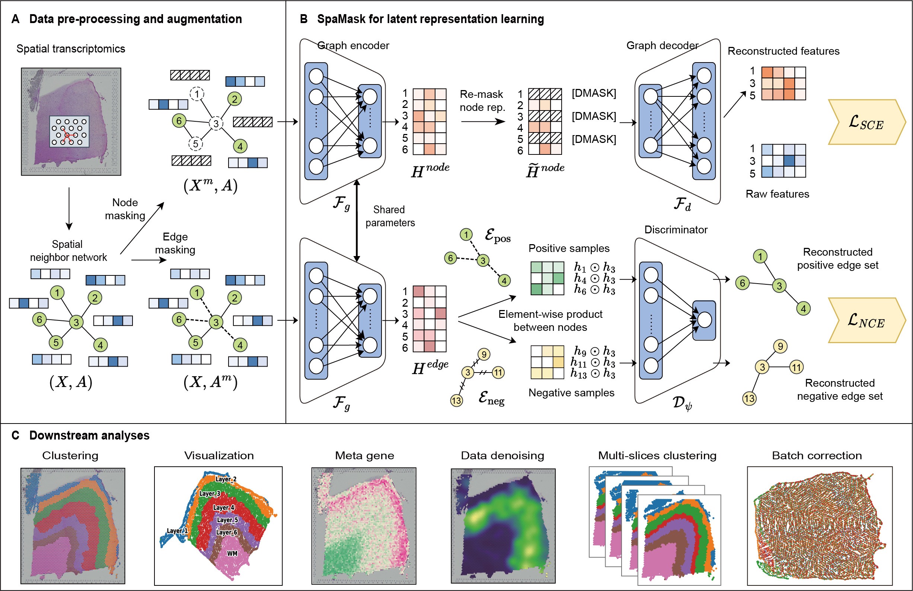

# SpaMask: Dual Masking Graph Autoencoder with Contrastive Learning for Spatial Transcriptomics 
## 🔥 Introduction
Understanding the spatial locations of cell within tissues is crucial for unraveling the organization of cellular diversity. Recent advancements in spatial resolved transcriptomics (SRT) have enabled the analysis of gene expression while preserving the spatial context within tissues. Spatial domain characterization is a critical first step in SRT data analysis, providing the foundation for subsequent analyses and insights into biological implications. Graph neural networks (GNNs) have emerged as a common tool for addressing this challenge due to the structural nature of SRT data.  However, current graph-based deep learning approaches often overlook the instability caused by the high sparsity of SRT data.  **Masking mechanisms**, as an effective self-supervised learning strategy, can enhance the robustness of these models.  To this end, we propose **SpaMask, dual masking graph autoencoder with contrastive learning for SRT analysis**. Unlike previous GNNs, SpaMask masks a portion of spot nodes and spot-to-spot edges to enhance its performance and robustness. SpaMask combines **Masked Graph Autoencoders (MGAE) and Masked Graph Contrastive Learning (MGCL)** modules, with MGAE using node masking to leverage spatial neighbors for improved clustering accuracy, while MGCL applies edge masking to create a contrastive loss framework that tightens embeddings of adjacent nodes based on spatial proximity and feature similarity. We conducted a comprehensive evaluation of SpaMask on **eight datasets from five different platforms**. Compared to existing methods, SpaMask achieves superior clustering accuracy and effective batch correction.

## 🌐 Data
- All public datasets used in this paper are available at [Zenodo](https://zenodo.org/records/14062665)

## 🔬 Setup
-   `pip install -r requirement.txt`

## 🚀 Get Started
We provided codes for reproducing the experiments of the paper, and comprehensive tutorials for using SpaMask.
- Please see `TutorialDonor.ipynb`.
