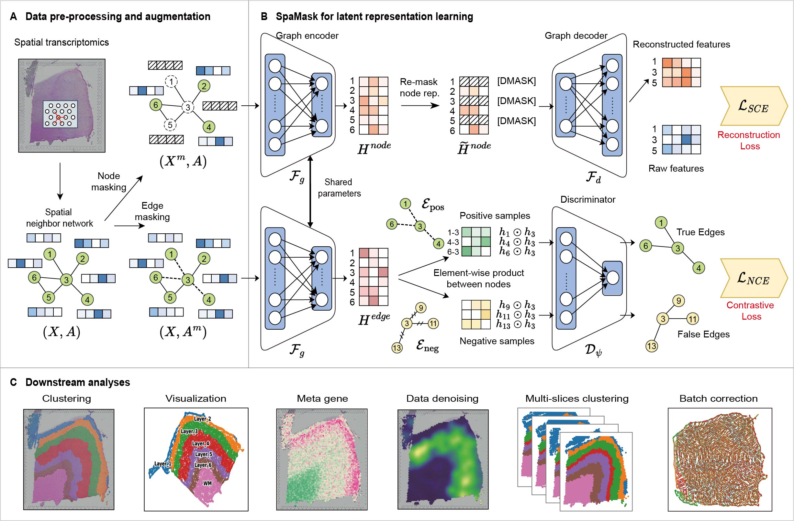

# SpaMask: Robust Spatial Domain Clustering in Spatial Transcriptomics via Self-Supervised Dual Masking Graph Deep Learning
## Introduction
In this study, we propose **a spatial transcriptomics analysis method based on dual masking mutual enhancement, referred to as SpaMask**. SpaMask employs a self-supervised learning framework that integrates a dual-channel shared graph encoder, combining graph autoencoders (GAE) and graph contrastive learning (GCL) to derive latent representations of transcript expression. In the GAE channel, we implement a **node masking mechanism that randomly masks the transcript expression** of selected spots. Under the influence of reconstruction loss, the information propagation mechanism of GNNs compels this channel to leverage the spatial neighbor information of the masked spots to infer the features of the target spot, thereby enhancing the suitability of these features for spatial domain clustering. In the GCL channel, we utilize an **edge masking mechanism to randomly remove certain neighboring edges** in the constructed spatial neighbor graph. Driven by contrastive loss, this channel infers potential missing edges from the remaining edges based on spatial proximity and feature similarity, facilitating tighter embeddings of adjacent nodes in the latent space. This approach ensures that the learned features reflect both spatial proximity and feature similarity. Finally, collective optimization through shared weights enables mutual enhancement of the dual masking. To evaluate the effectiveness of SpaMask, we conducted comparisons with various existing methods across eight datasets from five different platforms. The results demonstrate that SpaMask exhibits strong competitiveness in terms of clustering accuracy, dispersion, and batch correction capabilities.

## Data
- All public datasets used in this paper are available at [Zenodo](https://zenodo.org/records/14062665)

## Setup
-   `pip install -r requirement.txt`

## Get Started
We provided codes for reproducing the experiments of the paper, and comprehensive tutorials for using SpaMask.
- Please see `TutorialDonor.ipynb`.
